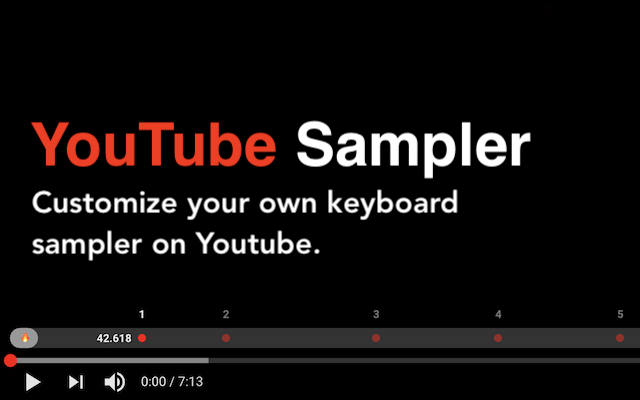

# [yt-sampler](https://chrome.google.com/webstore/detail/youtube-sampler/jfkkfiknnoojphipaipdojadlpdeljbj?hl=zh-TW&authuser=4)

Set your own keypoints for youtube shortcuts. Make YouTube videos your biggest sample inspiration database. You can now share queue points with your friends with `v.0.2`.

- [Chrome Web Store](https://chrome.google.com/webstore/detail/youtube-sampler/jfkkfiknnoojphipaipdojadlpdeljbj?hl=zh-TW&authuser=4)
- [demo video](https://www.youtube.com/watch?v=beKVsU-CC_c)

## Change Log

- v.0.2
  - share queue points with the url
  - add sample recorder and sequencer (beta)